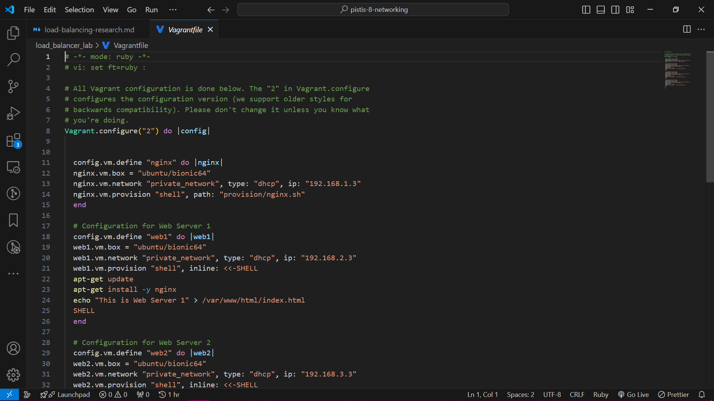
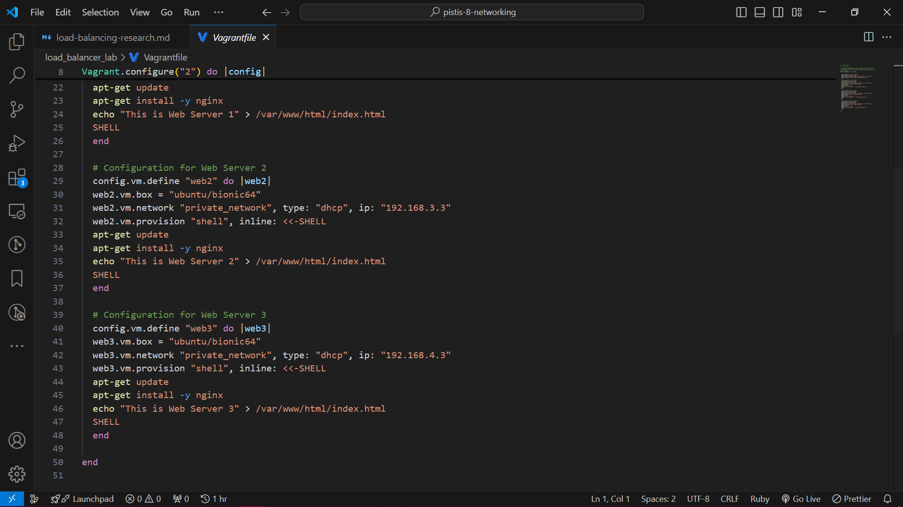
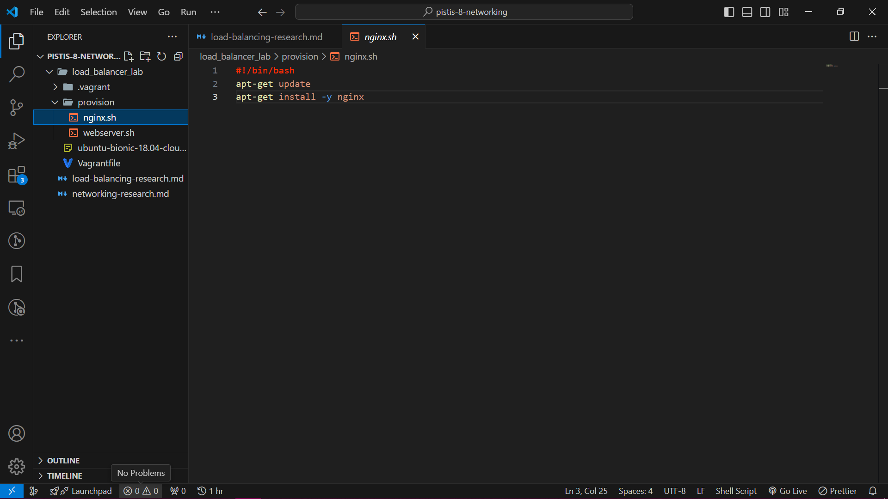
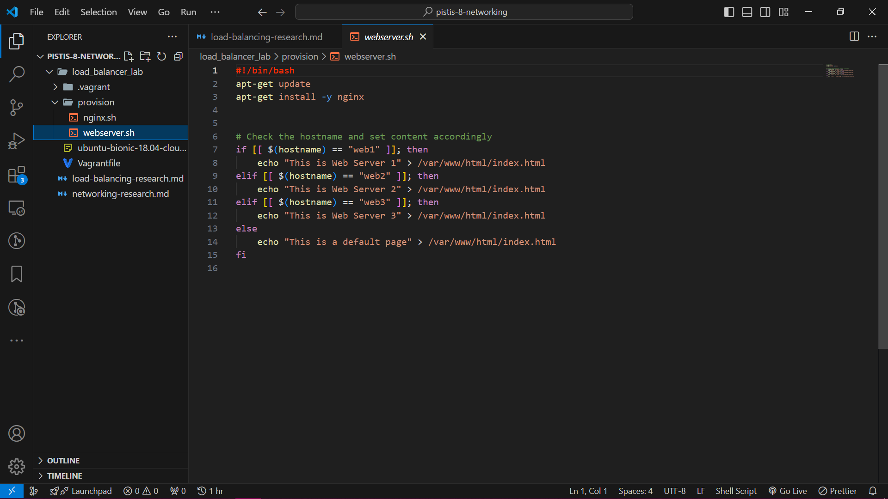
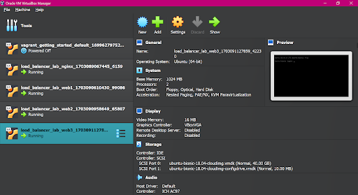
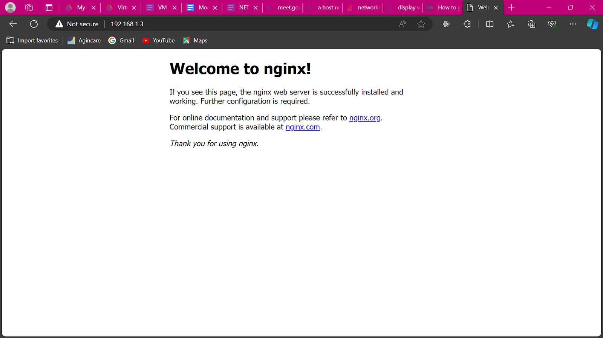
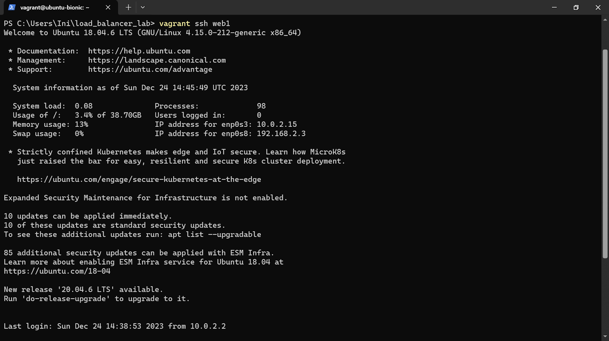
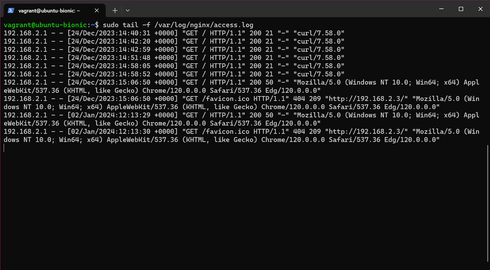
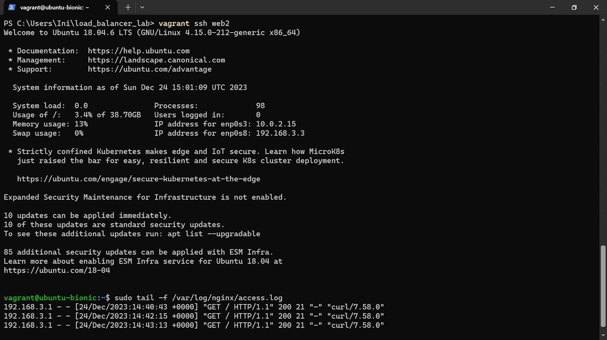
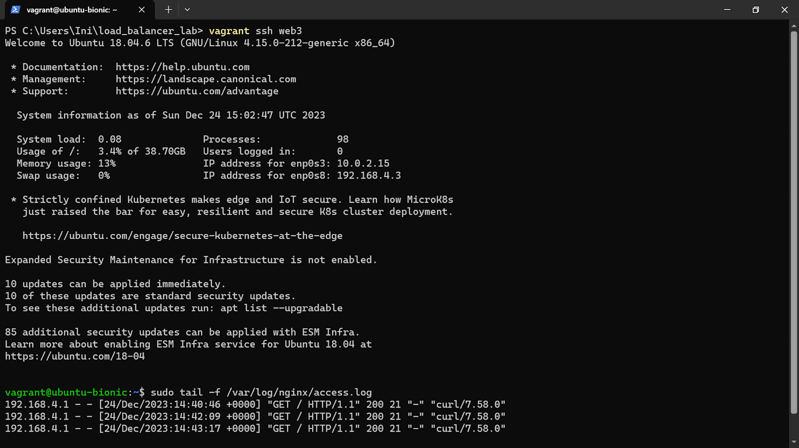

# NETWORKING LOAD BALANCING PROJECT

Load balancing is the practice of distributing computational workloads between two or more computers. It is often used to divide network traffic among several servers on the Internet, reducing the strain on each server and improving performance and latency.

## Creating a Load Balancer Lab with Nginx and Multiple Vagrant Servers Nginx

### Objective

Create a load balancer using Niginx, three web servers, and one Nginx server. The web servers should host informative HTML web pages. Vagrant was used to set up and manage the virtual machines on Virtualbox on a Windows OS. Notepad++ and VScode were used as editing tools for configuration files. The following were the steps taken for its successful implementation:

### Step 1: Prepare the Lab Directory

Prepare the lab directory by creating a new directory for my project that will contain the Vagrant configuration files, and navigating to it in my terminal.

```markdown
mkdir load_balancer_lab
cd load_balancer_lab
```

### Step 2: Set Up Vagrant Configuration

Set up vagrant configuration by creating a **Vagrantfile** to define your virtual machines and their configurations - `vagrant init hashicorp/bionic64`

Then configured the Vagrantfile with the right configurations to create nginx server and 3 web servers or virtual machines and host informative html pages each via provision scripts. Also specified unique private ip addresses each for them to successfully run on Virtualbox and be accessible easily since Virtualbox and Vagrant default configuration cannot run multiple VMs on the same ip address space at the same time, so this will prevent any DHCP error when you run the `vagrant up` command in the terminal.




### Step 3: Create Provisioning Scripts

Created provisioning scripts for Nginx and the web servers. These scripts will install Nginx on the Nginx server and configure informative HTML pages on the web servers.

Create provision/nginx.sh:



Create provision/webserver.sh:



### Step 4: Initialized and Start Vagrant machines

Initialized and started the Vagrant machines by navigating to my project directory in my terminal and then ran the following command to initialize and start the Nginx and web server virtual machines based on my Vagrant configuration - `vagrant up`



### Step 5: Configure Nginx Load Balancer

Configured Nginx Load Balancer by SSHing into the Nginx virtual machine from the terminal:

```vagrant
vagrant ssh nginx
```

Edited the Nginx configuration file to set up load balancing:

```markdown
sudo vi /etc/nginx/sites-available/default
```

Edited the file to include the following configuration inside the server block which was later omitted out because Nginx server refused to run its service and returned an upstream web_servers error:

```markdown
location / {
    proxy_pass http://web_servers;
}
upstream web_servers {
    server <web1_ip>:80;
    server <web2_ip>:80;
    server <web3_ip>:80;
}
```

### Step 6: Test the Load Balancer

Tested the Load Balancer by opening a web browser on my local machine and navigating to the private IP address of my Nginx VM. I observed the load-balanced web servers serving informative HTML pages in a round-robin manner.




### Step 7: Verify Load Balancing

I then verified that load balancing is working by SSHing into each web server to check their access logs. I noticed that requests were being distributed between the three web servers, demonstrating successful load balancing.

```markdown
vagrant ssh web1
tail -f /var/log/nginx/access.log
```




```markdown
vagrant ssh web2
tail -f /var/log/nginx/access.log
```



```markdown
vagrant ssh web3
cat /var/log/nginx/access.log
```



### Step 8: Check Load Balancing in a Web Browser

Finally, checked the load balancing in a web browser by opening a web browser on my local machine (not within the virtual machines), and entering the private IP address of my Nginx virtual machine in the browser's address bar.

I observed the load-balanced web servers in action, confirming that Nginx was successfully load-balancing the requests.


